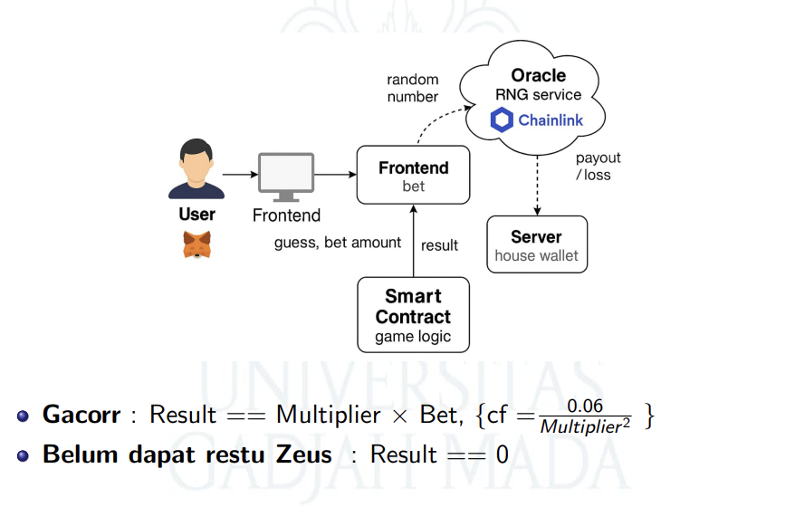

# GachaWeb3
**Codebase Final Project Blockchain**


This is a complete demonstration of a “gacha”‐style betting App using:

- **Solidity / Hardhat** (local chain at `http://127.0.0.1:8545`)  
- **Chainlink VRF (mock)** to supply randomness
- **Backend** places bet via dummy account. 
- **Node.js / Express** as an off‐chain listener & REST API  
- **Postman / curl** to fetch bet results

---


This is a simple Web3-powered gacha application that connects on-chain smart contracts with an off-chain REST API backend using dummy accounts and a mock oracle (VRFCoordinatorV2Mock).

---

##  How to Run the Project
### 1. Setup & Installation

1. **Clone / create this folder**  
   ```bash
   git clone <this‐repo‐url> gacha‐web3
   cd gacha‐web3
   ```
### 2. Start Local Hardhat Node (Terminal 1)

```bash
npm run node
```

This will launch a local Hardhat JSON-RPC node at `http://127.0.0.1:8545` with 10 pre-funded dummy accounts.

---

### 3. Deploy Contracts (Terminal 2)

```bash
npm run deploy:localhost
```

You should see the VRF mock deployed, a subscription created and funded, GachaGame deployed, and the consumer added. A file `deployed.json` will be written to the project root.\\

---

### 4. Fund GachaGame Contract (Terminal 3)

```bash
npx hardhat console --network localhost
```

Then in the console:

```js
const [deployer] = await ethers.getSigners();
const deployed    = require("../deployed.json");
const gacha       = await ethers.getContractFactory("GachaGame");
const gachaAddr   = deployed.GachaGame;

// Send 5 ETH so the contract can pay winners
await deployer.sendTransaction({
  to: gachaAddr,
  value: ethers.utils.parseEther("5.0")
});
console.log("Sent 5 ETH to GachaGame");
.exit
```

---

### 5. Start the Backend (Terminal 4)

```bash
npm run start:backend
```

You’ll see logs:

```
[Listener] Starting Chainlink event listener...
[Listener] Listening for BetResolved events on GachaGame: 0x...
=== Express server listening on http://localhost:3000 ===
POST /api/bet { multiplier, betAmount } to place a bet
GET  /api/bet/:requestId/status to fetch bet result
```

---

### 6. Place a Bet (Terminal 5 or Postman or curl)

Using `curl`:

```bash
curl -X POST http://localhost:3000/api/bet \
  -H "Content-Type: application/json" \
  -d '{"multiplier":3,"betAmount":"0.1"}'
```

You’ll get back a response like:

```json
{ "requestId": "42" }
```

Behind the scenes, the backend used the first Hardhat signer to call:

```js
gacha.placeBet(3, { value: ethers.utils.parseEther("0.1") });
vrfMock.fulfillRandomWords(42, gachaAddress);
```

The listener recorded the `BetResolved` event into `data/bets.json`.

---

### 7. Fetch the Bet Result

Using `curl`:

```bash
curl http://localhost:3000/api/bet/42/status
```

Example response **if the dummy account won**:

```json
{
  "requestId": "42",
  "player": "0xF39Fd6e51aad88F6F4ce6aB8827279cffFb92266",
  "won": true,
  "payout": "300000000000000000",
  "timestamp": 1685820000000
}
```

Or **if it lost**:

```json
{
  "requestId": "42",
  "player": "0xF39Fd6e51aad88F6F4ce6aB8827279cffFb92266",
  "won": false,
  "payout": "0",
  "timestamp": 1685820000000
}
```

---

## API Endpoints

* `POST /api/bet` — Place a new bet
* `GET /api/bet/:requestId/status` — Fetch bet result by requestId

